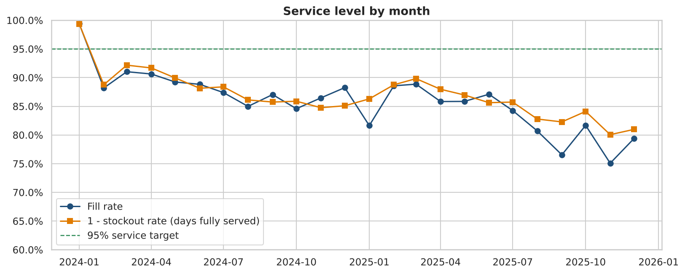
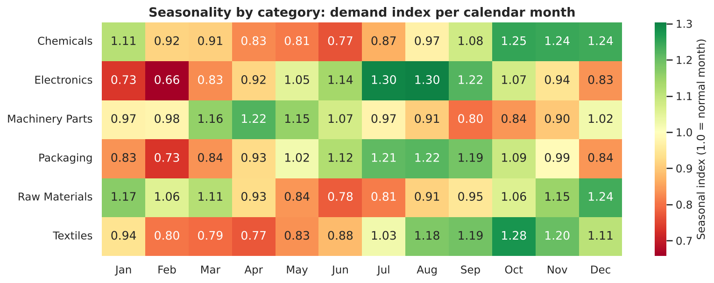
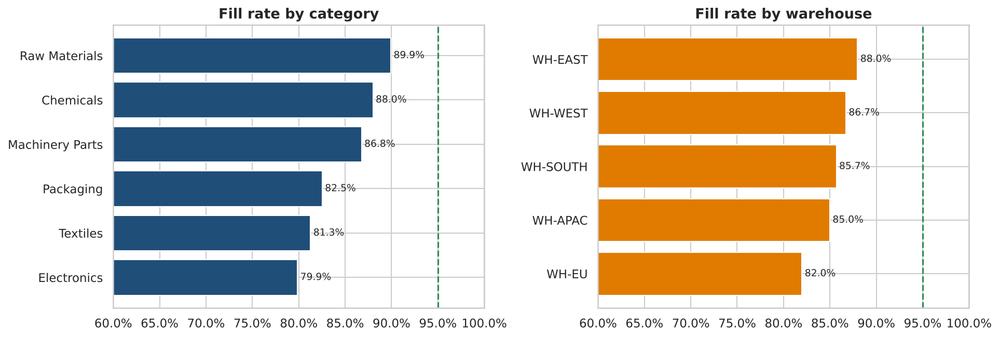
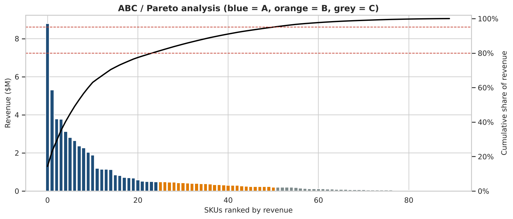
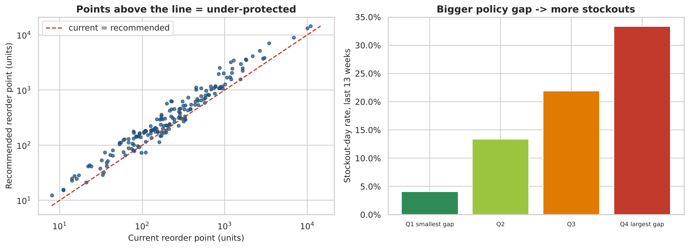
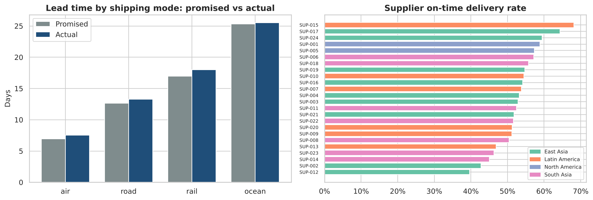
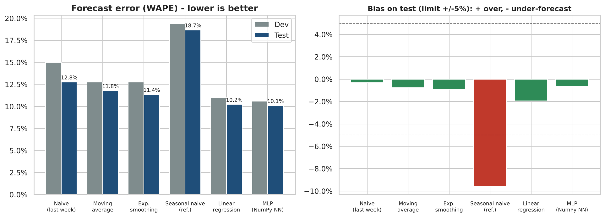
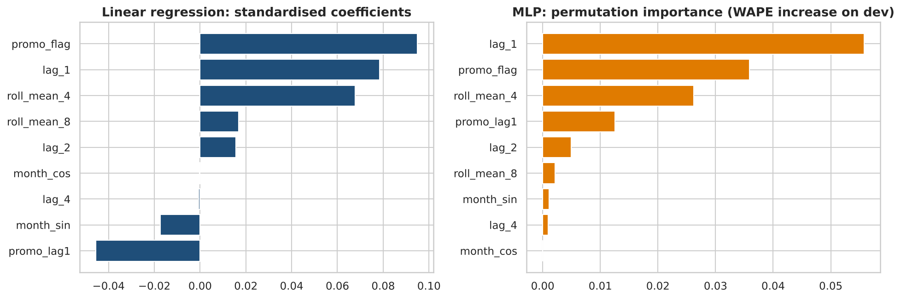
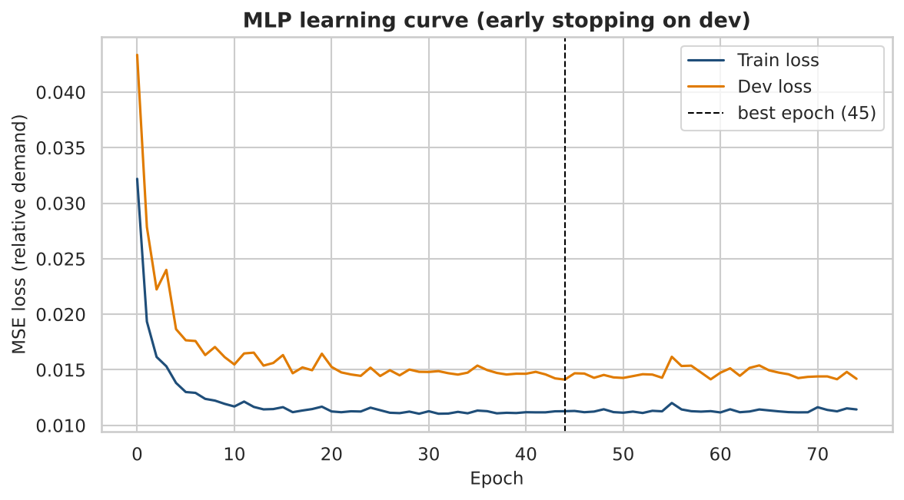
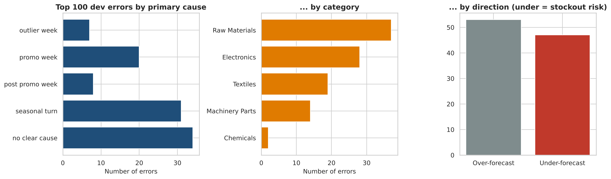

# ChainSight - Inventory & Demand Analytics (Data Analyst / Business Analyst portfolio project)

> **One line:** a supply-chain business keeps running out of its most valuable products. This project cleans the data, measures service and inventory KPIs, forecasts weekly demand (baselines first, a small neural network only as a challenger) and ends with prioritised actions.

**Story:** raw data -> cleaning -> EDA -> KPI analysis -> inventory / demand insights -> forecasting (baseline vs a simple neural network) -> business recommendations.

> **Data note:** the data is *synthetic* (generated by `src/datagen.py`, seed 42, reproducible) and deliberately messy. Every number below is produced by the code and written into this file by `src/10_render_docs.py` - nothing is typed by hand. The findings show what the method finds in data with these mechanisms; they are not claims about a real company.

---

## 1. Executive summary (the "so what" first)

| | |
|---|---|
| **Fill rate** | **85.6%** over 728 days - it fell from 92.9% (first 3 months) to 78.7% (last 3 months); only 1 of 24 months reached the 95% target |
| **Lost revenue from stockouts** | **$10.76M** = 14.9% of potential sales (revenue served: $61.51M) |
| **Where it hurts** | The top 15 SKUs cause 74% of lost revenue; the weakest category is Electronics (79.9% fill rate), the weakest warehouse is WH-EU (82.0%) |
| **Root cause found** | 164 of 180 SKU-warehouses (91%) have a reorder point below what current demand and real supplier lead times require; they stock out on 19.7% of days vs 2.1% for the others. The current policy carries a single set date (2024-03-31, week 13) while demand grew 12% year on year |
| **Inventory efficiency** | Turnover 24.6x per year, 14.5 days of inventory, average inventory value $695K |
| **Forecasting verdict** | The MLP beats the best baseline (Exp. smoothing) on the untouched test weeks: WAPE 10.1% vs 11.4% (11.1% relative improvement, and even its worst random seed beats the baseline). But plain linear regression with the same features already gets 10.2% (10.0% better than the baseline); the hidden layers add only 1.3% on top of that - below the bar, so the extra complexity is not justified. **Final model: Linear regression.** It earned its place on the dev set and was confirmed on test. |



**Top recommendations** (full list with numbers in section 6):

1. Weekly stockout review of the top-15 lost-revenue SKUs.
2. Refresh reorder points / safety stock every quarter from recent demand and *actual* lead times (phase 1: the 20 worst SKU-warehouses need about $411K of extra safety stock).
3. Set service targets by ABC class - today fill rate is nearly identical across A, B and C items (the policy ignores how important an item is).
4. Supplier scorecards + fewer emergency air shipments (extra freight about $721K over the period).
5. Use Linear regression for weekly forecasts; keep the neural network as a quarterly challenger.

---

## 2. Problem and questions

A distributor holds 90 SKUs in 6 product categories across 5 warehouses and buys from 24 suppliers. Management asks:

1. How good is our service level (fill rate, stockouts) and where is it worst?
2. Is inventory working hard (turnover, days of inventory) or is it badly allocated?
3. Which items matter most (ABC) and which are hard to predict (demand variability)?
4. Are suppliers and shipping modes reliable enough for our reorder logic?
5. Can we forecast weekly demand better than simple rules - and is a neural network worth its complexity?

## 3. Dataset

Synthetic, 104 weeks (2024-01-01 to 2025-12-28), generated by a day-by-day simulation reused from the original ChainSight project (periodic-review reorder policy, supplier lead-time and reliability logic). Raw tables in `data/raw/`:

| Table | Grain | Rows (raw) |
|---|---|---|
| `demand_daily` | SKU x warehouse x day (demanded, fulfilled, promo flag) | 131,695 |
| `inventory_daily` | SKU x warehouse x day (on hand, in transit) | 131,433 |
| `purchase_orders` | one PO (promised vs actual delivery, ship mode, freight) | 7,012 |
| `products`, `suppliers`, `warehouses`, `inventory_policy` | master data / current reorder policy | small |

Hidden simulation parameters (true noise, trend, seasonality) are **not** exported, so the analysis starts from the same information a real analyst would have. See `docs/DATA_DICTIONARY.md`.

## 4. Approach and key findings (each step ends with a "so what")

### 4.1 Cleaning (`src/cleaning.py`, `notebooks/01_cleaning.ipynb`)
The raw files contain duplicates, mixed date formats, lowercase / padded codes, negative and impossible quantities, extreme typos and missing values (injected randomly and reproducibly). Each rule is logged: **5,998 records** were corrected or removed. Check: cleaning the messy data recovers the hidden clean data (tested in `tests/test_cleaning.py`).

| table | rows_raw | rows_clean | null_cells_raw | null_cells_clean |
|---|---|---|---|---|
| warehouses | 5 | 5 | 0 | 0 |
| purchase_orders | 7012 | 6991 | 219 | 680 |
| products | 92 | 90 | 3 | 0 |
| suppliers | 24 | 24 | 2 | 0 |
| demand_daily | 131695 | 131040 | 394 | 0 |
| inventory_daily | 131433 | 131040 | 395 | 0 |
| inventory_policy | 180 | 180 | 0 | 0 |

*So what:* duplicates and sign errors would have inflated demand and distorted fill rate; the log (`outputs/tables/cleaning_log.csv`) makes every change auditable.

### 4.2 EDA (`src/05_eda.py`, `notebooks/02_eda.ipynb`)



- **Trend:** total weekly demand grows 13.6% per year (12.0% year-on-year); fastest category Textiles (19.8% per year), slowest Packaging (6.2%).
- **Seasonality differs by category:** peaks - Chemicals: Oct; Electronics: Aug; Machinery Parts: Apr; Packaging: Aug; Raw Materials: Dec; Textiles: Oct. Most seasonal: Electronics (swing of 0.65 index points); least: Machinery Parts (0.42).
- **Region:** North America is 46% of demand.
- **SKU profile:** the largest SKU sells 235.5x the smallest; median demand CV is 0.38 (11 low, 74 medium, 5 high-variability SKUs).
- **Promotions:** Promotions are a real demand driver: promo weeks run at 1.23x the previous 8-week average vs 0.98x for normal weeks.

*So what:* one flat reorder parameter per SKU cannot fit a business with a growing trend, category-specific seasonal peaks and promotions.

### 4.3 KPI analysis (`src/kpis.py`, `src/06_kpi_analysis.py`, `sql/`)



| KPI | Value |
|---|---|
| Fill rate | 85.6% |
| Stockout-day rate (SKU-warehouse-days) | 13.0% |
| Inventory turnover | 24.6x / year |
| Days of inventory | 14.5 |
| Lost revenue | $10.76M |

- Best / worst category by fill rate: Raw Materials (89.9%) / Electronics (79.9%). Raw Materials loses the most money (27% of lost revenue) because it is the biggest category.
- **Turnover:** best Electronics (34.4x), lowest Raw Materials (19.7x), which holds 54% of all inventory value.
- **Days of inventory vs service:** SKUs holding fewer days of stock have clearly lower fill rates (correlation 0.70); the quarter of SKUs with the least stock has a 78.8% fill rate vs 92.0% for the quarter with the most.

**ABC analysis** (A = first 80% of revenue):



25 A SKUs (28% of SKUs) generate 81% of revenue and hold 82% of inventory value, while 39 C SKUs make only 4.9% of revenue. Fill rate: A 85.7%, B 85.3%, C 85.0% - nearly identical across A, B and C items (the policy ignores how important an item is). A items carry 82% of lost revenue.

*So what:* service effort is not aligned with value - the most important items lose the most money.

**Reorder point and safety stock check** (formula: `safety stock = z x sqrt((LT + R) x sigma_d^2 + mean_d^2 x sigma_LT^2)`, `ROP = mean demand x LT + safety stock`):



164 of 180 SKU-warehouses are under-protected; SKU-warehouses whose reorder point is below the recommended level stock out far more often (19.7% vs 2.1%). Stockout rate rises from 4.1% in the quarter with the smallest gap to 33.3% in the quarter with the largest (correlation 0.79). The extra safety stock this implies is $586K in total (84% of current average inventory) - an upper bound, so we phase it (see recommendations).

**Lead times** (`sql/05_lead_time.sql`): 6,821 delivered POs; average promised 16.7 days vs actual 17.2; **53.1% on time**; late POs are 5.0 days late on average. Supplier on-time rate ranges 40% (SUP-012) to 68% (SUP-015). Slowest supplier region: East Asia (20.2 days) vs North America (3.6). Air freight is 31% of POs and costs 12.0% of goods value vs 4.5% for other modes.



*So what:* measured lead-time variability must enter the reorder formula, and late suppliers drive expensive emergency shipments.

### 4.4 Forecasting (`src/07_forecasting.py`, `notebooks/04_forecasting.ipynb`)

**Setup.** Weekly demand per SKU (90 SKUs). **Time-based split**: weeks 1-72 train (5,760 rows), 73-88 dev (1,440), 89-104 test (1,440); the test set is used once. Dev and test are consecutive recent blocks of the same process, but not identical: mean relative demand is 1.08 on dev vs 1.18 on test (demand trends upward), promo-week share 12.0% vs 10.9%.
Forecast horizon: next week (one step ahead). Demand (not sales) is forecast, because stockouts hide true demand.
**Features** (known before the target week): lag 1/2/4, rolling mean 4/8, month (sin/cos), promo flag of the target week, promo flag of the previous week. SKUs are scaled by their train-period mean; features are standardised with train statistics only.
**Models:** Naive, Moving average (window 4), Exponential smoothing (alpha 0.4) - window/alpha chosen on dev; seasonal naive as a reference; linear regression; and an MLP written from scratch in NumPy (He init, ReLU, L2, mini-batch Adam, early stopping, gradient-checked in `tests/test_nn_gradcheck.py`). Selected MLP on dev: hidden (16, 8), L2 0.001, dropout 0.0.
**Metrics:** the single optimising metric is **WAPE** (sum of absolute errors / sum of actual demand); satisficing metrics are RMSE (must not be worse than naive), bias within +/-5%, and interpretability.

| model | WAPE_train | WAPE_dev | WAPE_test | RMSE_test | Bias_test | interpretable | passes_gates |
|---|---|---|---|---|---|---|---|
| Naive (last week) | 13.4% | 15.0% | 12.8% | 127.34 | -0.3% | Yes - one line | yes |
| Moving average | 12.4% | 12.8% | 11.8% | 113.61 | -0.8% | Yes - one line | yes |
| Exp. smoothing | 12.1% | 12.8% | 11.4% | 111.86 | -0.9% | Yes - one parameter | yes |
| Seasonal naive (ref.) | 19.1% | 19.4% | 18.7% | 171.67 | -9.6% | Yes - one line | no |
| Linear regression | 10.3% | 11.0% | 10.2% | 100.16 | -1.9% | Yes - 9 coefficients | yes |
| MLP (NumPy NN) | 9.9% | 10.6% | 10.1% | 99.00 | -0.7% | Partly - needs permutation importance | yes |



**Honest conclusion.** The MLP beats the best baseline (Exp. smoothing) on the untouched test weeks: WAPE 10.1% vs 11.4% (11.1% relative improvement, and even its worst random seed beats the baseline). But plain linear regression with the same features already gets 10.2% (10.0% better than the baseline); the hidden layers add only 1.3% on top of that - below the bar, so the extra complexity is not justified. The seasonal-naive reference (same week last year) scores 18.7% on test, worse than the simple baselines: in this data recent weeks carry more information than the same week a year ago. The MLP passes both satisficing gates (|bias| <= 5% and RMSE no worse than naive). Over 5 random seeds its test WAPE ranges 10.1% - 10.6%. As an independent check, scikit-learn's `MLPRegressor` with the same architecture gets 10.5% on test, so the NumPy implementation is behaving. **Final model: Linear regression.** It earned its place on the dev set and was confirmed on test.

**Interpretability trade-off.** The linear model is read straight from its 9 coefficients; the MLP has 305 weights and can only be explained indirectly (permutation importance: 'lag_1' matters most, then 'promo_flag').



**Bias / variance diagnosis** (best baseline's train error is the "human-level proxy"): avoidable bias of the MLP = -2.1% (negative = it already beats the proxy on training weeks), variance = 0.7% (dev minus train error). The model already beats the baseline proxy on the training weeks and generalises: bias and variance are both small. Remaining error is likely noise or information these features do not contain.



**Error analysis** (the 100 largest MLP errors on the dev set, which cover 50% of total dev error; full row-by-row table in `outputs/tables/error_analysis_top100.csv` with empty `manual_cause` / `notes` columns for you to fill in):

| primary_cause | n_errors | abs_error_units | under_forecast | share_of_errors | share_of_error_units |
|---|---|---|---|---|---|
| outlier_week | 7 | 4,297.36 | 7 | 7.0% | 15.8% |
| promo_week | 20 | 5,130.47 | 4 | 20.0% | 18.9% |
| post_promo_week | 8 | 2,735.69 | 2 | 8.0% | 10.1% |
| seasonal_turn | 31 | 7,278.01 | 14 | 31.0% | 26.8% |
| no_clear_cause | 34 | 7,696.68 | 20 | 34.0% | 28.4% |

The largest bucket is 'no clear cause' with 34 of the top 100 errors (34%). 47% of these big errors are under-forecasts (stockout risk). Tags (a row can have several): promo week 26, post-promo week 8, outlier week 7, seasonal turn 44. A-class SKUs account for 93% of the big errors; the MLP beats the baseline on 44% of these rows. *So what:* most of the biggest errors have none of our simple causes (promo, outlier, seasonal turn): they look like noise or missing information, so a bigger network is unlikely to help - review the rows manually and look for new features (price, weather, customer orders).



**What accuracy is worth.** Sizing safety stock from the MLP's forecast errors instead of the Exp. smoothing's makes the indicative requirement lower by 14.8% ($176K vs $150K) - an illustration, not a promise (assumes independent weekly errors and normal demand).

## 5. Repository structure

```
data/raw/        messy source files (generated)        data/processed/  cleaned CSVs + chainsight.db (SQLite)
notebooks/       01 cleaning, 02 EDA, 03 KPIs, 04 forecasting, 05 recommendations
src/             numbered scripts 01..10 + library modules (kpis, cleaning, features, baselines, nn_numpy ...)
sql/             schema + KPI, window-function, ABC, stockout, lead-time, data-quality queries
outputs/         charts (PNG), tables (CSV), dashboard (CSV star schema + Excel), sql_results
tests/           pytest suite        docs/  data dictionary, audit of the original repo, templates
```

Setup and run order: **README_SETUP.md**. Interview preparation: **INTERVIEW_NOTES.md**.

## 6. Business recommendations (generated from the findings)

# Business recommendations (generated from the data)

### 1. Fix the top lost-revenue SKUs first | Value at stake: $7.97M (lost revenue, whole period)
**Finding:** The top 15 SKUs account for 74% of all lost revenue (15 of them are A items); the worst is SKU-00049 with $1.49M.

**Action:** Run a weekly stockout review on these 15 SKUs: confirm lead time, check open POs, raise reorder points before touching the long tail.

**Track:** Lost revenue of top-15 SKUs

### 2. Reorder policy refresh | Value at stake: $2.30M (lost revenue, last 13 weeks)
**Finding:** Fill rate fell from 92.9% (first 3 months) to 78.7% (last 3 months) while demand grew 12.0% year on year. 164 of 180 SKU-warehouses (91%) have a reorder point below what current demand and actual lead times require; they run a 19.7% stockout-day rate vs 2.1% for the rest.

**Action:** Re-calculate safety stock and reorder point every quarter from the last 13 weeks of demand and the supplier's ACTUAL lead time and its variability. Phase 1: the 20 SKU-warehouses that lost the most revenue in the last 13 weeks ($1.61M, 70% of the total) need about $411K of extra safety stock (59% of today's average inventory value).

**Track:** Fill rate, stockout-day rate, inventory turnover

### 3. ABC-differentiated service levels | Value at stake: $8.81M (A-class lost revenue, whole period)
**Finding:** A items are 28% of SKUs but 81% of revenue and 82% of lost revenue, yet their fill rate (85.7%) is within 0.8 percentage points of C items (85.0%): every SKU gets the same service-level target.

**Action:** Set service targets by class (for example 98% for A, 95% for B, 90% for C). C items hold only 4.9% of inventory value, so the extra A-item stock has to be budgeted, not funded by trimming C.

**Track:** Fill rate by ABC class, lost revenue in class A

### 4. Supplier lead-time reliability
**Finding:** Only 53.1% of delivered POs arrive on or before the promised date; late POs are 5.0 days late on average. On-time rate ranges from 39.6% (SUP-012) to 68.1% (SUP-015); 5 of 24 suppliers are below 50% on-time.

**Action:** Start a monthly supplier scorecard (on-time %, delay days, lead-time CV), escalate the bottom suppliers, and use measured lead time + variability (not the quoted lead time) in safety-stock formulas.

**Track:** On-time delivery %, lead-time CV by supplier

### 5. Expediting cost | Value at stake: $721K (extra freight vs non-air rates, whole period)
**Finding:** 31% of POs ship by air at 12.0% of goods value vs 4.5% for other modes - about $721K of extra freight over the period.

**Action:** Fewer emergency orders: earlier reorder triggers (see policy refresh) are cheaper than air freight. Review air shipments by SKU and keep air only for A items.

**Track:** Air-freight share of POs, freight % of PO value

### 6. Promotion planning
**Finding:** Promo weeks run at 1.23x the previous 8-week average (normal weeks 0.98x). Stockout rate on promo days is 15.4% vs 12.9% on normal days.

**Action:** Share the promotion calendar with planning and add the promo flag to the forecast (it is the planned, known input the baselines ignore). Build stock one lead time BEFORE a promo.

**Track:** Stockout rate on promo days

### 7. Seasonal stock planning
**Finding:** Electronics swings 0.65 index points between its peak (Aug, 1.30) and low (Feb, 0.66) month; category peaks fall in different months.

**Action:** Adjust reorder points by the monthly seasonal index, so stock is built ahead of each category's peak rather than a flat yearly parameter.

**Track:** Fill rate in peak months by category

### 8. Forecasting model choice
**Finding:** On the untouched test weeks the best baseline (Exp. smoothing) has WAPE 11.4%, linear regression 10.2% and the MLP 10.1%. The MLP beats the best baseline, but adds only 1.3% relative improvement over linear regression. Chosen model: Linear regression.

**Action:** Use Linear regression for weekly forecasts (promo flag + recent demand + month), keep the Exp. smoothing as the fallback and the MLP as a challenger to re-test each quarter.

**Track:** WAPE, bias on a rolling basis

### 9. Forecast accuracy -> safety stock
**Finding:** Using the MLP's forecast errors instead of the Exp. smoothing's changes the indicative safety-stock requirement by -14.8% ($176K -> $150K).

**Action:** Size safety stock from forecast error (not raw demand variability) once the forecast is live; track the realised error each month.

**Track:** Forecast error std per SKU, safety-stock value

### 10. Data quality at the source
**Finding:** Cleaning corrected or removed 5,998 records (duplicates, impossible values, mixed formats).

**Action:** Add input validation in the ERP export: unique keys, non-negative quantities, ISO dates, controlled category lists.

**Track:** Rows rejected by validation per load


## 7. Limitations

- **Synthetic data.** Mechanisms (trend, seasonality, promo uplift, supplier delays) are designed; real data has more noise, structural breaks and missing history.
- **Messy data is injected.** The cleaning rules fit the injected problems; real systems need discovery first.
- **One-step-ahead forecasts.** Replenishment needs lead-time-ahead (multi-week) forecasts; error grows with horizon.
- **Demand vs sales.** Here true demand is observable; in real data stockouts censor sales, which would need correcting.
- **Dev and test are not identical** (demand trends upward), so test WAPE is not directly comparable to dev WAPE.
- **Safety-stock numbers are indicative.** They assume normal demand and independent errors, and the lead-time variability is taken from history.
- **No cost model.** Holding cost, margin and service-level trade-offs are not optimised; recommendations are directional.
- **Small neural network, small data** (5,760 training rows): results vary by seed (range shown above).

## 8. About the original ChainSight repo

This project restructures the original web-app repo in place: the React/FastAPI/Postgres/Docker layer, risk-scoring ML and anomaly-detection experiments were removed; the simulation logic, KPI definitions, ABC and reorder-point ideas were kept and fixed. The audit (what was reused, removed and why, plus bugs found in the original) is in `docs/AUDIT.md`.
