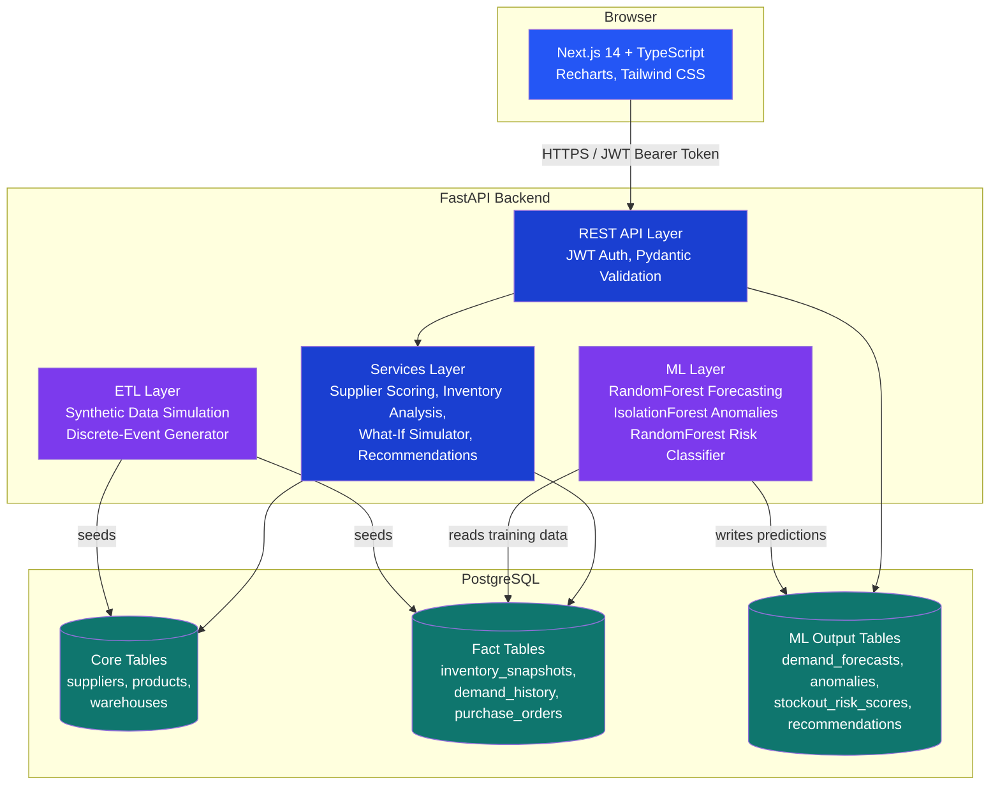
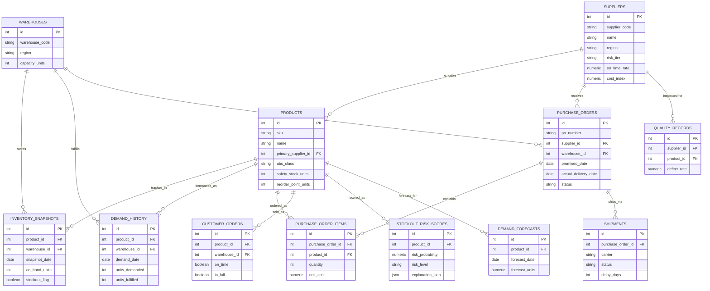
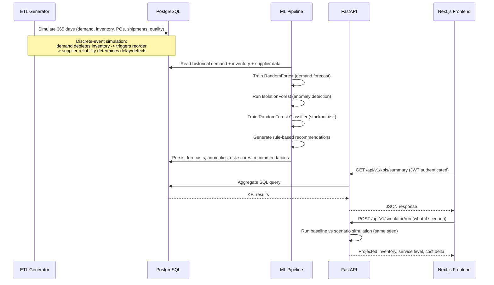

# ChainSight — Architecture

## System overview

Three containers, orchestrated by Docker Compose: a Next.js frontend, a
FastAPI backend (which also owns the ETL simulation and ML pipeline as
Python modules invoked at startup / on demand), and PostgreSQL.

## Database schema (entity-relationship diagram)

Full DDL with indexes and views: [`db/init.sql`](../db/init.sql).

## Data flow: from raw simulation to a dashboard number

The key design point: the ETL step is a genuine day-by-day simulation, not
independently randomized columns. Demand depletes real inventory; crossing
a reorder point triggers a real purchase order; a supplier's latent
reliability parameter determines whether that order arrives late or fails
inspection. That causal structure is what makes the downstream ML meaningful
— the models are learning real (simulated) patterns, not noise.
